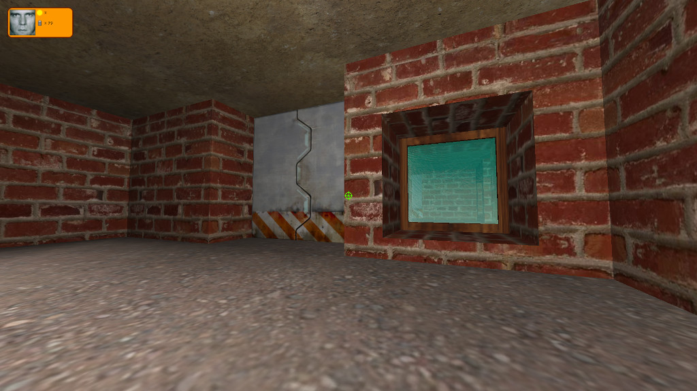

# G.W.O.P. - Game without plot

Another of my prehistoric projects in c++ and OpenGL I made around 2008 while being a university student. Despite having the poorest code quality ever it's a fully functional FPS game.

## Features

* 5 levels
* 1 type of gun
* 5 types of enemies (each requires different amount of hits to die)
* Collectibles:
    * ammo
    * life
    * keys with different colors (opening different doors)
* Obstacles:
    * destructible crates
    * spikes
    * air blowing fans

## Controls

`W`,`A`,`S`,`D` - movement

`Mouse` - looking around

`LMB` - shoot

## Requirements

* Windows
* Graphic card compatible with OpenGL